# Приложение с акциями МосБиржи

Десктопное приложение, которое создаёт реляционную базу данных торгов на Московской бирже (*PostgreSQL*). 

## Функционал:
- скачивание листингов торгов и загрузка в БД
- получение отчётов по динамике стоимости и доходности активов, в виде графиков
- выгрузка отчётов в Excel

## Запуск

- Необходимо установить библиотеки из файла `requirements.txt` командой: 
```
pip install -r requirements.txt
```
- В конфигурационном файле `parameters.py` прописать данные для подключение к БД PostgreSQL 
- Запустить файл `main.py` командой: 
```
python main.py
```

## Архитектура приложения

`main.py` - точка входа в приложение. Происходит вызов двух функций: подключение к БД (в случае отсутсвия происходит её создание), отрисовка графического интерфейса

`parameters.py` - файл конфигурации для базы данных

`db_maker` - модуль, в котором находятся классы создания таблиц и функции для взаимодействия с БД

`loader.py` - модуль для скачивания и преобразования файлов листинга акций с МосБиржи

`window.py` - модуль графического интерфейса приложения


## Интерфейс
После запуска приложения пользователю будет доступно данное окно:

|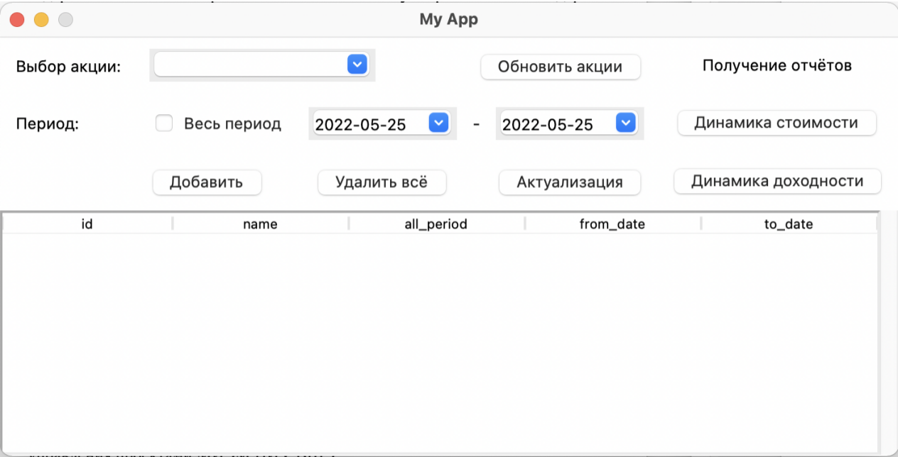|
|:--:| 
| *Главное окно приложения* |


Если приложение запущено первый раз, то выпадающий список акций будет пустым:


|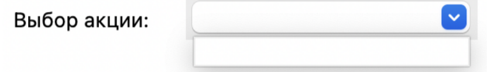|
|:--:| 
| *Пустой выпадающий список при первом запуске* |


Для загрузки списка необходимо нажать на кнопку «Обновить акции»:

||
|:--:| 
| *Кнопка «Обновить акции»* |

В связи с нестабильной работой API для получения информации об акциях, может произойти ошибка (происходит очень редко). Нужно перезапустить программу и всё заработает. В выпадающем списке появятся акции.

|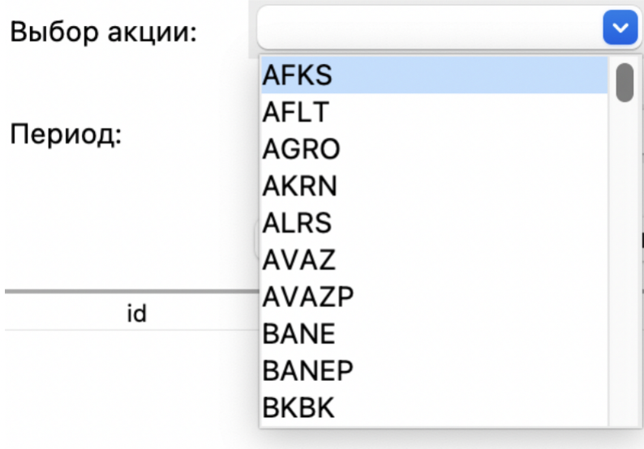|
|:--:| 
| *Выпадающий список с акциями* |


Затем нужно выбрать акцию, путем нажатия на неё из выпадающего списка


|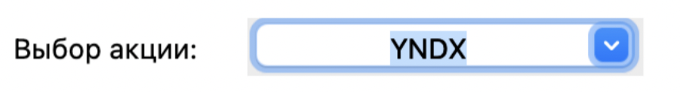|
|:--:| 
| *Меню «Выбор акции» после выбора акции* |


После этого нужно выбрать период, за который нужно скачать информацию.


|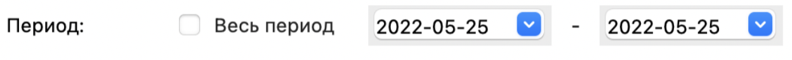|
|:--:| 
| *Меню «Период»* |


|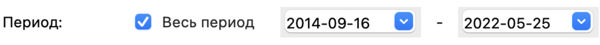|
|:--:| 
| *Меню «Период», выбран весь период* |


В случае если выбраны неверные даты:
* Дата начала периода больше или равна дате окончания периода
* Дата окончания периода меньше или равна дате начала периода 
* Один из периодов не входит в границы торгов этой акции
Пользователю будет выдано предупреждение. Чтобы убрать её нужно нажать кнопку «ОК» в выскочившем окне. 

|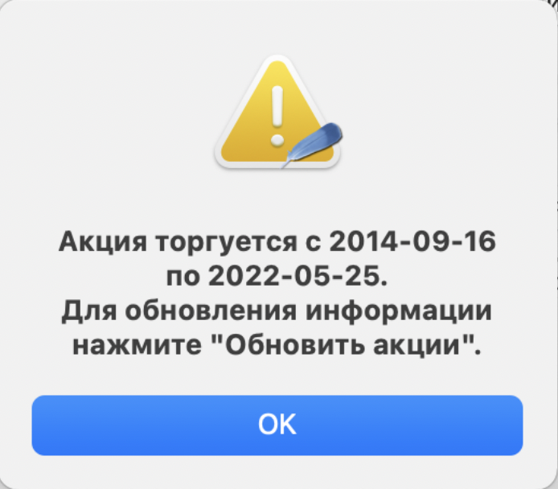|
|:--:| 
| *Предупреждение при неправильном выборе даты* |


В случае если пользователь уверен, что акция торговалась после периода окончания, представленного в приложении, ему предлагается обновить информацию путём нажатия кнопки «Обновить акции».
После нажатия кнопки «Добавить», информация об акции добавится в БД. Это отразится в таблице: 

|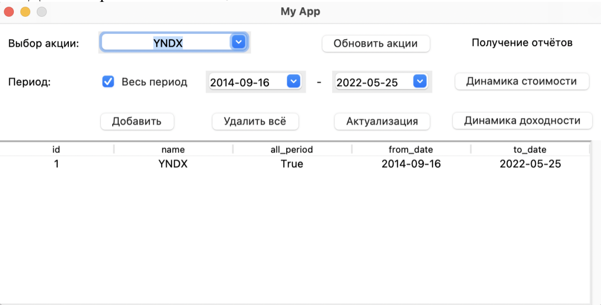|
|:--:| 
| *Приложение, после добавления акции* |


В связи с нестабильной работой библиотеки yfinance, которая отвечает за скачивание информации, листинг может скачаться не всегда. В этом случае приложение уведомит вас:


||
|:--:| 
| *Уведомление о неуспешном скачивании данных* |


Функционалом приложения не предусмотрено то, что пользователь может добавить информацию по акции дважды. В БД эти данные попадут, но никак не скажутся на отчётах. 
При нажатии кнопки «Удалить всё» удаляется вся информация о скачанных акциях.
Если листинги по акциям скачивались за весь период сколько-то времени назад. То можно использовать режим актуализации БД. Для этого необходимо нажать кнопку «Обновить акции», чтобы обновить информацию о периодах торгах акций. Затем нажать кнопку «Актуализация». Пример:


|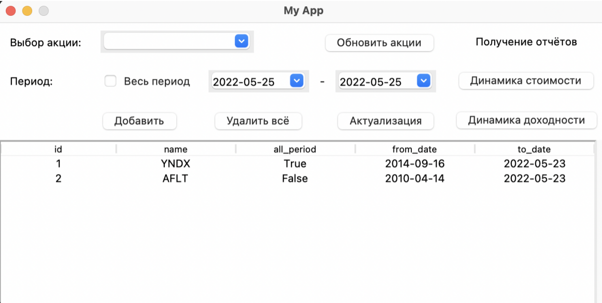|
|:--:| 
| *БД до актуализации* |


||
|:--:| 
| *БД после актуализации* |


Отчёты можно получить, нажав на кнопки «Динамика стоимости» или «Динамика доходности». После этого откроется окно, где можно посмотреть график, нажав на кнопку «График». И скачать отчёт в excel, нажав на кнопку «Скачать в excel». Если нажать сначала на вторую кнопку то выскочит предупреждение о том, что нужно сначала построить график. 


|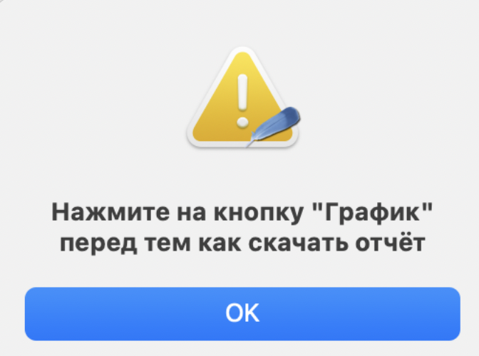|
|:--:| 
| *Предупреждение о необходимости сначала построить график* |


|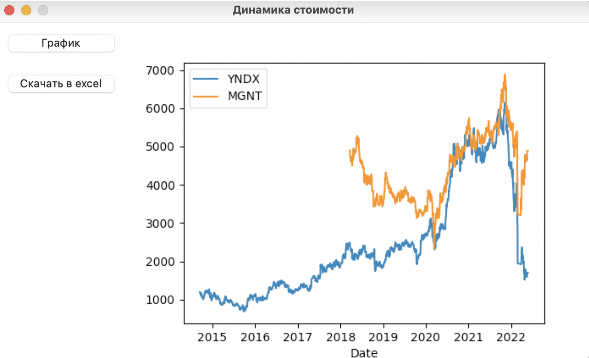|
|:--:| 
| *Окно для получения отчётов* |


При скачивании отчёта в excel, появится строка состояния, показывающая ход процесса загрузки

|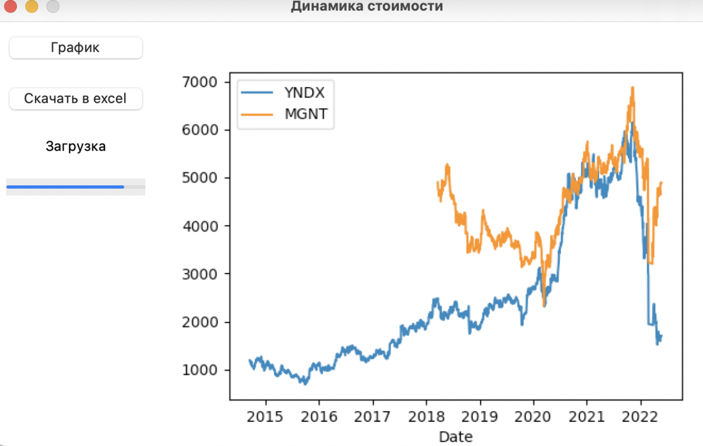|
|:--:| 
| *Окно со строкой состояния* |


Скачанные отчёты будут называться «output_cost.xslx» и «output_profit.xslx». И будут находится в корневой директории приложения.


|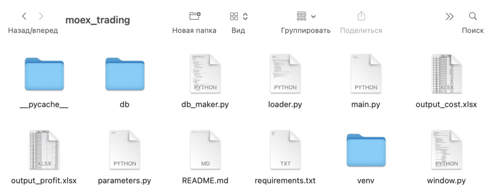|
|:--:| 
| *Файлы excel* |


||
|:--:| 
| *Excel отчёт* |


